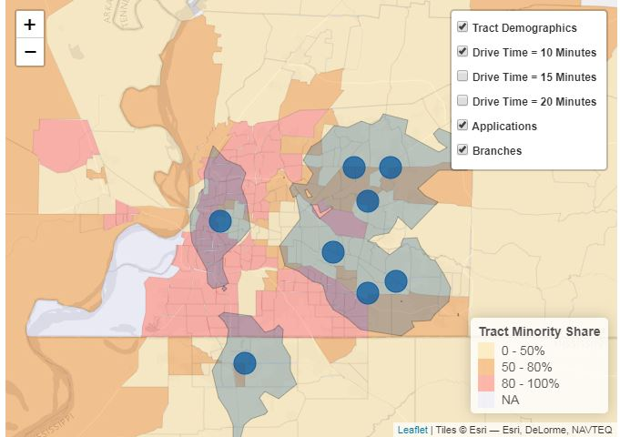

 
<strong> A Textual Analysis of Every U.S. General Election Debate </strong>   
A set of textual analyses covering every general election Presidential and Vice Presidential debate in U.S. History (before the final 2020 Trump-Biden debate).  
[<a href="https://domrussel.github.io/assets/files/us_pres_debate.html">View Project</a>] | [<a href="https://github.com/domrussel/us_pres_debate">View GitHub Repo + Data</a>]
 

 
<strong> Random Person App </strong>   
Shiny app that generates random income identities based on global income data; inspired by the Rawlsian notion of the <a href="https://en.wikipedia.org/wiki/Veil_of_ignorance">veil of ignorance</a>. [<a href="https://domrussel.shinyapps.io/Person_App/">View Project</a>] [<a href="https://github.com/domrussel/random_person">View GitHub Repo</a>]
 

 
<strong> Flagship Public University Affordability by State </strong>   
A simple interactive dashboard that shows measures related to change in two quantities from 1970 to 2017 by state - median household income and in-state tuition at the flagship public university. [<a href="https://domrussel.shinyapps.io/tuition_income/">View Project</a>] [<a href="https://github.com/domrussel/tuition_income">View GitHub Repo</a>]
 

 
<strong> Redlining Maps </strong>   
A public version of some of the interactive redlining maps I've created in R, using Leaflet. [<a href="https://domrussel.github.io/redlining/">View Project </a>] [<a href="https://github.com/domrussel/redlining">[View GitHub Repo</a>]
 

